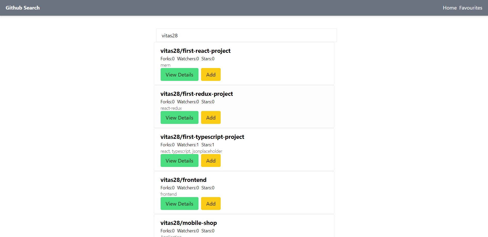
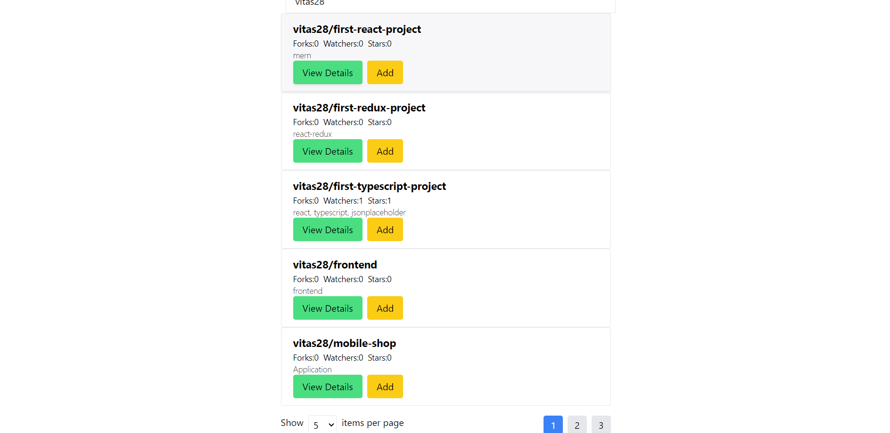

1. Screenshots:
   
   
   

2. In the project you can see 3 pages:

   - Repository list:
     Here displaying search bar where you can search some github profile.
     When you select one, you will see all repositories and pagination.
     You also can add some repo to favourites list.
   - Reposity Details
     In this page showing details and link to repo.
   - Favourites Pages
     Favourites Page you can see repositories which you added to favourites.

3. Run the project:

- npm install
- npm start
